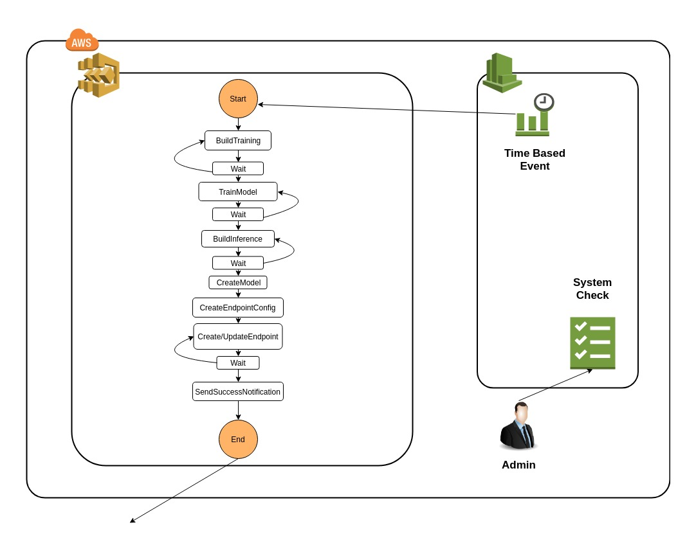

# Architecture

## Overview

This folder contains the javascript code of functions that can be used within the step functions. For example, the CreateTrainingJob file contains all code to train a new model and save the output.