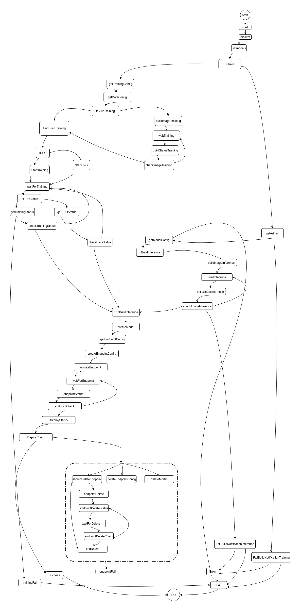

# Material taken from SageBuild Example

This folder contains code for the resources created from the Sagebuild template.

## State Machine

The state machine is the main function provided by Sagebuild, responsible for invoking the lambda function used for maintaining continous improvement and deployment of machine learning models.

