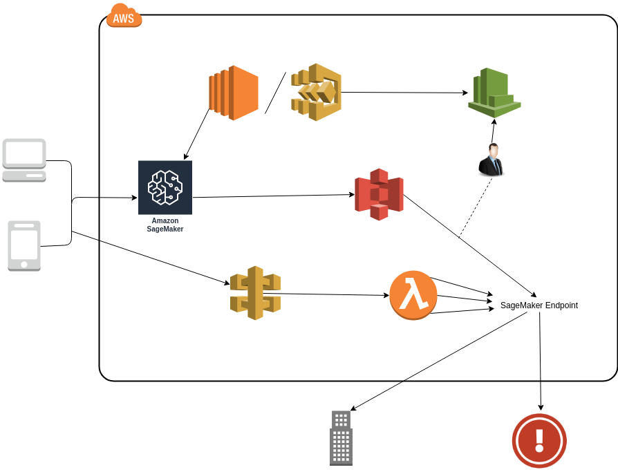

# Machine Learning Framework

Here is the repository that contains all materials for the ML systems attached to the VoX Wallet.

## Getting Started

These instructions will get you a copy of the project up and running on your local machine for development and testing purposes. See deployment for notes on how to deploy the project on a live system.

## Development

### Machine Learning Techniques

## Deployment

### AWS Architecture

Below shows a technical diagram of what the operational network will look like when deployed

## Built With

* [AWS](https://aws.amazon.com/) - The cloud interface used
* [Serverless](https://serverless.com/) 

## Authors

* **Sam Peek** - *Initial work* - [supsam89](https://github.com/supsam89)